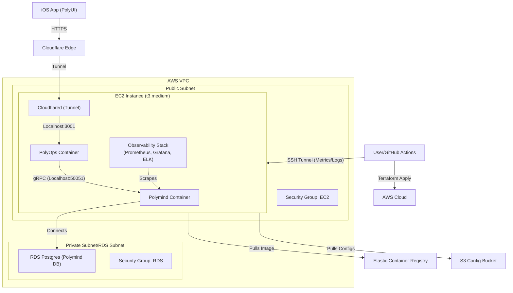

# Infra: Cloud Infrastructure for Polymind

This repository contains the Terraform configuration and infrastructure-as-code (IaC) definitions required to deploy the **Polymind** trading bot environment on AWS.

## 🏗 Architecture

The infrastructure is designed for high availability, security, and automated deployment.



### Key Components

*   **Compute**: 
    *   **EC2 (t3.medium)**: Hosts the `polymind` and `polyops` containers.
    *   **Auto Scaling Group (ASG)**: Ensures exactly one instance is running at all times (self-healing).
    *   **Launch Template**: Defines the instance configuration (AMI, Instance Type, IAM Profile, User Data).
*   **Storage & Config**:
    *   **S3 Config Bucket**: centralized storage for configuration files (Docker Compose, Prometheus, Grafana Dashboards) to bypass User Data size limits.
    *   **Security Secrets**: Secrets (`DB_PASSWORD`, `LLM_API_KEY`) are passed from GitHub Secrets to Terraform to the instance via secure environment variables.
*   **Database**:
    *   **Amazon RDS (PostgreSQL 16)**: Managed relational database for persistent storage (Events, Signals, Orders, Positions).
    *   **Storage**: gp3 EBS volumes.
*   **Security**:
    *   **IAM Roles**: Least-privilege roles for the EC2 instance (ECR access, SSM access, CloudWatch logs).
    *   **External Access**:
        *   **Cloudflare Tunnel**: Securely exposes the `PolyOps` API to the internet without opening inbound ports.
    *   **Security Groups**: 
        *   `ec2-sg`: Allows outbound traffic and necessary inbound (e.g., SSH if configured).
        *   `rds-sg`: Restricts database access to the EC2 security group (and temporarily public for dev testing).
*   **Containerization**:
    *   **Docker**: The application runs as a Docker container managed by `docker-compose`.
    *   **ECR**: Stores the Docker images built by CI/CD.
*   **Observability**:
    *   **Prometheus**: Scrapes metrics from `polymind:9000`.
    *   **Grafana**: Visualizes metrics (Pre-provisioned datasource).
    *   **Elasticsearch & Kibana**: centralized logging and analysis.
    *   **Network**: All containers run on `polymind_net` bridge network.

## 🛠 Tech Stack

-   **Terraform**: Infrastructure provisioning.
-   **AWS**: Cloud provider (US-East-1).
-   **Docker & Docker Compose**: Application runtime.
-   **Bash**: Bootstrapping and deployment scripts.

## 🚀 Deployment

### Prerequisites

1.  **Terraform**: `v1.0+`
2.  **AWS CLI**: Configured with appropriate credentials (`~/.aws/credentials`).
3.  **S3 Backend**: An S3 bucket for Terraform state (configured in `backend.hcl`).
4.  **AWS Key Pair**: An existing EC2 Key Pair (create in AWS Console) for SSH access.
5.  **Cloudflare Tunnel Token**: A token from the Cloudflare Zero Trust dashboard.

### Steps to Deploy

1.  **Initialize**:
    ```bash
    cd env/prod
    terraform init
    ```

2.  **Plan**:
    Review the changes before applying.
    ```bash
    terraform plan \
      -var="db_username=admin" \
      -var="db_password=securepass" \
      -var="llm_api_key=sk-..." \
      -var="key_name=my-key-pair" \
      -var="cloudflared_token=eyJh..."
    ```

3.  **Apply**:
    Provision the resources.
    ```bash
    terraform apply \
      -var="db_username=admin" \
      -var="db_password=securepass" \
      -var="llm_api_key=sk-..." \
      -var="key_name=my-key-pair" \
      -var="cloudflared_token=eyJh..."
    ```

### Bootstrapping

The **User Data** script (`bootstrap.sh.tpl`) automatically:
1.  Installs Docker and Docker Compose on the EC2 instance.
2.  Authenticates with ECR.
3.  Pulls the latest `polymind` image.
4.  Starts the application using `docker-compose`.

## 📂 Directory Structure

```
infra/
├── env/
│   └── prod/               # Production environment configuration
│       ├── main.tf         # EC2, ASG, Launch Template
│       ├── rds.tf          # Database configuration
│       ├── iam.tf          # Permissions and Roles
│       ├── network.tf      # Networking (Security Groups)
│       ├── providers.tf    # AWS Provider setup
│       ├── variables.tf    # Input variables
│       ├── outputs.tf      # Output values (e.g., RDS Endpoint)
│       └── bootstrap.sh.tpl # EC2 startup script
└── ...
```

### Key Components

*   **Compute**: 
    *   **EC2 (t3.small)**: Hosts the `polymind` application container.
    *   **Auto Scaling Group (ASG)**: Ensures exactly one instance is running at all times (self-healing).
    *   **Launch Template**: Defines the instance configuration (AMI, Instance Type, IAM Profile, User Data).
*   **Database**:
    *   **Amazon RDS (PostgreSQL 16)**: Managed relational database for persistent storage (Events, Signals, Orders, Positions).
    *   **Storage**: gp3 EBS volumes.
*   **Security**:
    *   **IAM Roles**: Least-privilege roles for the EC2 instance (ECR access, SSM access, CloudWatch logs).
    *   **Security Groups**: 
        *   `ec2-sg`: Allows outbound traffic and necessary inbound (e.g., SSH if configured).
        *   `rds-sg`: Restricts database access to the EC2 security group (and temporarily public for dev testing).
*   **Containerization**:
    *   **Docker**: The application runs as a Docker container managed by `docker-compose`.
    *   **ECR**: Stores the Docker images built by CI/CD.

## 🛠 Tech Stack

-   **Terraform**: Infrastructure provisioning.
-   **AWS**: Cloud provider (US-East-1).
-   **Docker & Docker Compose**: Application runtime.
-   **Bash**: Bootstrapping and deployment scripts.

## 🚀 Deployment

### Prerequisites

1.  **Terraform**: `v1.0+`
2.  **AWS CLI**: Configured with appropriate credentials (`~/.aws/credentials`).
3.  **S3 Backend**: An S3 bucket for Terraform state (configured in `backend.hcl`).

### Steps to Deploy

1.  **Initialize**:
    ```bash
    cd env/prod
    terraform init
    ```

2.  **Plan**:
    Review the changes before applying.
    ```bash
    terraform plan -var="db_username=admin" -var="db_password=securepass" -var="llm_api_key=sk-..." -var="key_name=my-key-pair"
    ```

3.  **Apply**:
    Provision the resources.
    ```bash
    terraform apply -var="db_username=admin" -var="db_password=securepass" -var="llm_api_key=sk-..." -var="key_name=my-key-pair"
    ```

### Bootstrapping

The **User Data** script (`bootstrap.sh.tpl`) automatically:
1.  Installs Docker and Docker Compose on the EC2 instance.
2.  Authenticates with ECR.
3.  Pulls the latest `polymind` image.
4.  Starts the application using `docker-compose`.

## 📊 Accessing Observability Dashboards

Since Grafana (port 3000) and Kibana (port 5601) are not exposed to the public internet for security, you must use an SSH tunnel to access them.

Run the following command locally:

```bash
# Replace <key.pem> with your SSH key and <EC2_PUBLIC_IP> with the instance IP
ssh -i <key.pem> -L 3000:localhost:3000 -L 5601:localhost:5601 -L 9090:localhost:9090 ec2-user@<EC2_PUBLIC_IP>
```

Then visit in your browser:
*   **Grafana**: [http://localhost:3000](http://localhost:3000) (User/Pass: `admin`/`admin`)
    *   **Dashboard**: Go to Dashboards -> **Polymind Main**
*   **Kibana**: [http://localhost:5601](http://localhost:5601)
*   **Prometheus**: [http://localhost:9090](http://localhost:9090)

## 🐛 Troubleshooting

*   **Check Bootstrapping Logs**:
    To see the output of the User Data script (cloud-init):
    ```bash
    ssh -i <key.pem> ec2-user@<EC2_PUBLIC_IP>
    cat /var/log/cloud-init-output.log
    ```

*   **Manual Kibana Provisioning**:
    If the dashboard or index pattern is missing, you can re-run the provisioning script manually:
    ```bash
    cd /opt/stack
    ./provision_kibana.sh
    # Check logs
    cat provision.log
    ```
